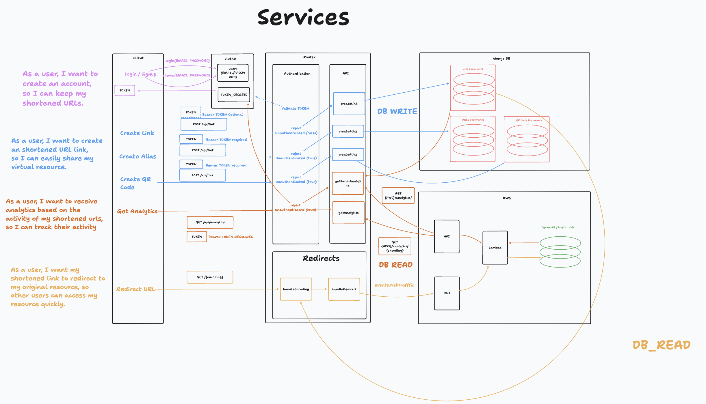

# url-shortener

Web Service for virtual resource sharing and analytics.

## Usage

### Installation

In order to run the server follow these steps:

1. Download the source code to your machine: `git clone <URL>`.
1. Install the project using npm:

    ```bash
    $ cd url-shortener
    $ npm install
    ```

1. Configure you're environment variables:

    **Authentication**

    This service uses auth0 to authenticate requests, and allows users to register new User Profiles and create Access Tokens.  You will need to configure the following environment variables to execute these features:

    ```.env
    JWKS_URI=<AUTH0_KEY_SIGNING_URL>
    AUTH0_DOMAIN=<DOMAIN_FROM_SETTINGS>
    AUTH0_CLIENT_ID=<CLIENT_ID_FROM_SETTINGS>
    AUTH0_CLIENT_SECRET=<APP_SECRET_FROM_SETTINGS>
    ```

    **Request Analytics**

    This service processes redirect requests and stored analytics on AWS, AWS credentials are required with permissions for SNS topics, and a URL for API Gateway and an API Key.  Add a the following environment variables to enable web analytics:

    ```.env
    AWS_ACCESS_KEY=<AWS_KEY_CREDENTIAL>
    AWS_ACCESS_SECRET=<AWS_SECRET_CREDENTIAL>
    AWS_REGION=<AWS_SERVICE_REGION>
    ANALYTICS_API_URL=<API_GATEWAY_URL>
    ANALYTICS_API_KEY=<API_GATEWAY_API_KEY>
    ```

    **MongoDB and Express**

    Express will expose a PORT in development mode and the models require a valid mongo DB connection string to process database reads and writes.  Add the following variables to enable these features:

    ```.env
    PORT=<NUMBER>
    MONGO_URL=<MONGO_DB_URL>
    ```

### Running the Server

* Run test environment:

    ```bash
    $ npm test
    ```

* Run development server:

    ```bash
    $ npm run dev
    ```

* Run production server:

    ```bash
    $ npm start
    ```

## Features



### Profiles

User profiles are managed by Auth0.  Client Applications are responsible for authenticating with the Auth0 user database and assigning tokens for user sessions.

### Links

Given a valid url, the url-shortener will create a shortened link to the provided resource.

#### Time Limits

By default all links created will be temporary, lasting 1 week, after that time and data associated with the links will be removed.  If a user creates an account, Links will exist Indefinitely.

#### QR Codes

QR codes can be generated for users with authentication credentials.

#### Customization

Authenticated users are allowed to 

### Analytics

Analytics data represents information regarding link usage.  As links are assigned attributes and context, these data collections will be used to build a platform to allow users insights into link activity.
